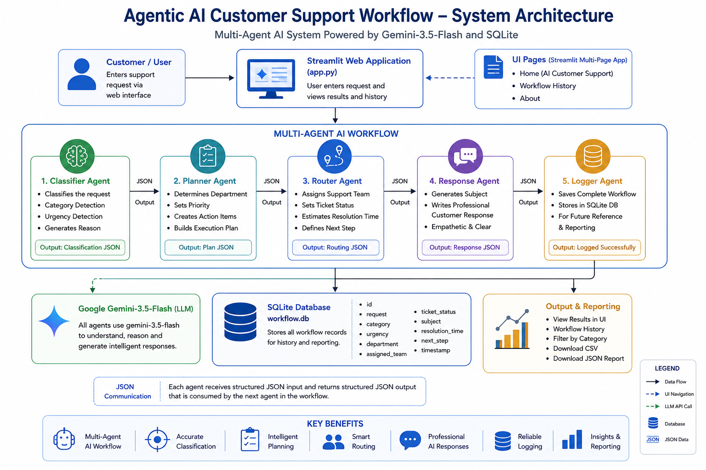
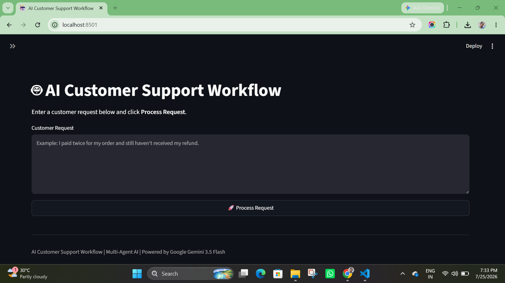
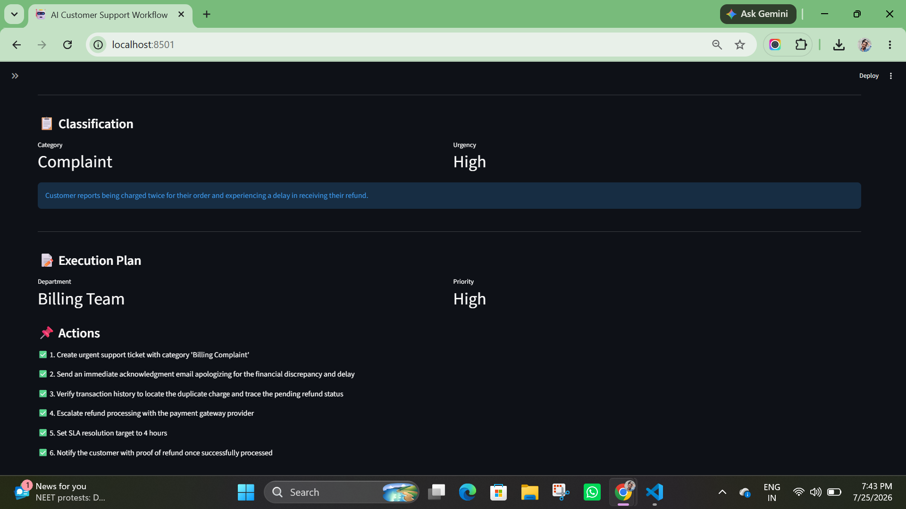
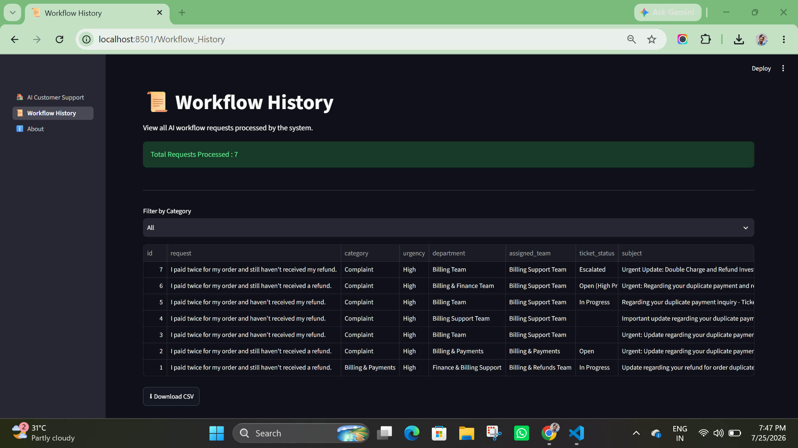
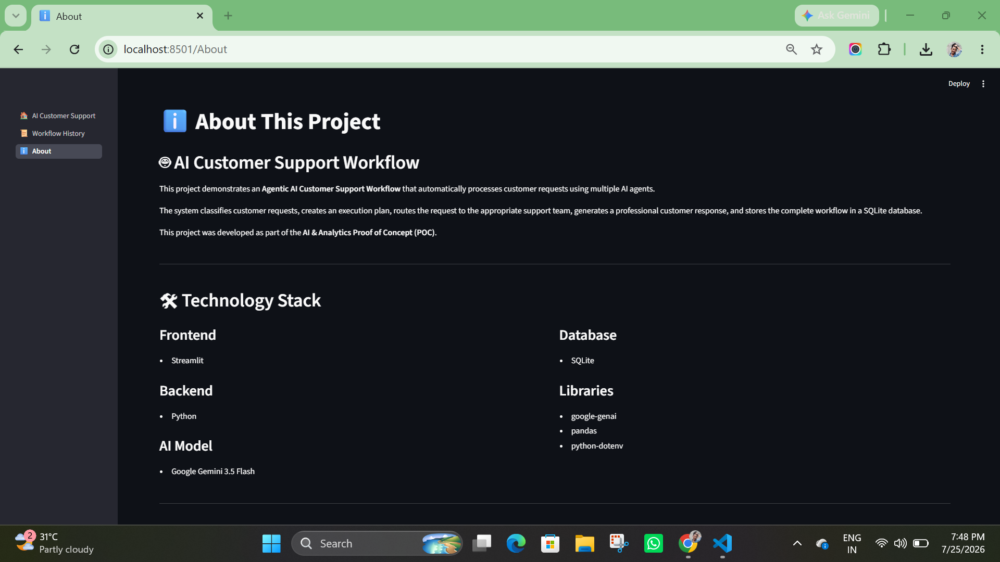

# 🤖 Agentic AI Customer Support Workflow

An intelligent **Multi-Agent AI Customer Support System** built using **Google Gemini, Streamlit, and SQLite**. This project demonstrates how multiple AI agents collaborate to automate customer support by classifying requests, planning actions, routing tickets, generating professional responses, and storing the complete workflow in a database.

> **Developed as part of the AI & Analytics Proof of Concept (POC) Assignment for Firstsource Solutions.**

---

# 📖 Overview

Traditional customer support systems rely heavily on manual processing, resulting in slower response times and inconsistent handling of customer issues.

This project demonstrates an **Agentic AI architecture**, where multiple specialized AI agents work together to automate the complete customer support workflow.

The system performs the following tasks:

- Understands customer requests
- Classifies request category and urgency
- Creates an execution plan
- Routes the request to the appropriate support team
- Generates a professional customer response
- Stores the workflow in a SQLite database
- Displays workflow history through an interactive dashboard

---

# ✨ Features

- 🤖 Multi-Agent AI Architecture
- 🧠 AI-powered Request Classification
- 📋 Intelligent Execution Planning
- 🚦 Automated Ticket Routing
- 💬 Professional AI Customer Response
- 🗄 SQLite Workflow Logging
- 📊 Workflow History Dashboard
- 📥 Download Workflow Report (JSON)
- 📄 Export Workflow History (CSV)
- ☁️ Streamlit Cloud Deployment
- 🎨 Responsive Streamlit UI

---

# 🏗️ System Architecture



## Workflow

```
Customer Request
        │
        ▼
Classifier Agent
        │
        ▼
Planner Agent
        │
        ▼
Router Agent
        │
        ▼
Response Agent
        │
        ▼
Logger Agent
        │
        ▼
SQLite Database
```

---

# 🛠️ Technology Stack

| Technology | Purpose |
|------------|---------|
| Python | Backend Development |
| Streamlit | Web Application |
| Google Gemini | Large Language Model (LLM) |
| SQLite | Database |
| Pandas | Data Processing |
| Google GenAI SDK | Gemini Integration |
| python-dotenv | Environment Variable Management |

---

# 📂 Project Structure

```
agentic-ai-customer-support/
│
├── agents/
│   ├── classifier.py
│   ├── planner.py
│   ├── router.py
│   ├── responder.py
│   └── logger.py
│
├── database/
│   └── db.py
│
├── pages/
│   ├── 1_📜_Workflow_History.py
│   └── 2_ℹ️_About.py
│
├── utils/
│   ├── gemini_client.py
│   └── json_parser.py
│
├── assets/
│   └── architecture.png
│
├── screenshots/
│   ├── home.png
│   ├── workflow.png
│   ├── history.png
│   └── about.png
│
├── tests/
│
├── requirements.txt
├── README.md
├── .gitignore
└── 🏠_AI_Customer_Support.py
```

---

# ⚙️ Installation

## Clone the repository

```bash
git clone https://github.com/krishnasairayavaram/agentic-ai-customer-support.git
```

## Navigate to the project directory

```bash
cd agentic-ai-customer-support
```

## Create a virtual environment

```bash
python -m venv venv
```

### Windows

```bash
venv\Scripts\activate
```

### Linux / macOS

```bash
source venv/bin/activate
```

## Install dependencies

```bash
pip install -r requirements.txt
```

## Configure Gemini API Key

Create a `.env` file in the project root.

```
GEMINI_API_KEY=YOUR_GEMINI_API_KEY
```

---

# ▶️ Running the Application

Start the Streamlit application.

```bash
streamlit run "🏠_AI_Customer_Support.py"
```

The application will open automatically in your browser.

---

# 🔄 Workflow Explanation

## Step 1 — Classifier Agent

The Classifier Agent analyzes the customer request and identifies:

- Request Category
- Urgency
- Reason for classification

---

## Step 2 — Planner Agent

The Planner Agent creates an execution strategy by generating:

- Responsible Department
- Priority
- Action Plan

---

## Step 3 — Router Agent

The Router Agent determines:

- Assigned Support Team
- Ticket Status
- Estimated Resolution Time
- Next Action

---

## Step 4 — Response Agent

The Response Agent generates a professional and empathetic customer response including:

- Email Subject
- Customer Response Message

---

## Step 5 — Logger Agent

The Logger Agent stores the workflow in SQLite, including:

- Customer Request
- Classification
- Execution Plan
- Routing Details
- AI Response
- Timestamp

---

# 📸 Screenshots

## 🏠 Home Page



---

## 🤖 Workflow Processing



---

## 📜 Workflow History



---

## ℹ️ About Page



---

# 📊 Sample Workflow

### Customer Request

```
I paid twice for my order but still haven't received my refund.
```

### AI Classification

- Category: Complaint
- Urgency: High

### Execution Plan

- Department: Finance Team
- Priority: High
- Actions Generated by AI

### Routing

- Assigned Team: Billing Support
- Ticket Status: Open
- Estimated Resolution: 24 Hours

### Customer Response

A professional AI-generated response is produced and displayed to the customer.

### Logging

The complete workflow is automatically stored in the SQLite database and can be viewed from the **Workflow History** page.

---

# 🚀 Future Enhancements

- 🔐 User Authentication
- 📧 Email Notifications
- 📱 SMS Notifications
- 🌍 Multi-language Support
- 📈 Analytics Dashboard
- 😊 Sentiment Analysis
- 📚 RAG-based Knowledge Base
- 🤖 AI Chatbot Integration
- ☁️ Cloud Database (PostgreSQL / MySQL)
- 🎟 Ticket Assignment Automation

---

# 👨‍💻 Developer

**Krishna Sai**

**GitHub**

https://github.com/krishnasairayavaram

---

# 📜 License

This project was developed for educational purposes as part of the **Firstsource Solutions AI & Analytics Proof of Concept (POC)**.

Feel free to use and modify this project for learning purposes.